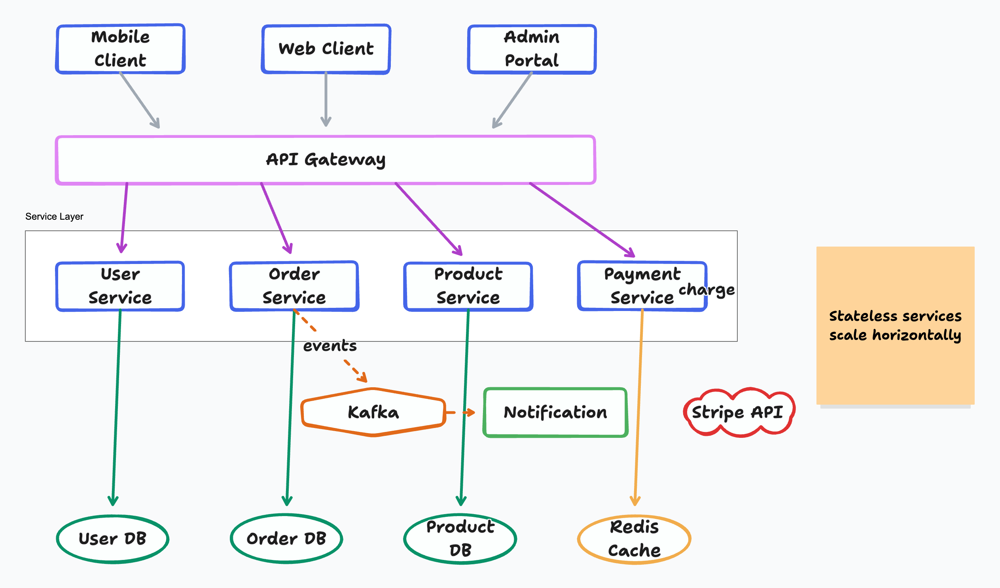

# tldraw-skill —— 从文字到白板风格图表

[English](README.md) | [在线文档](https://agents365-ai.github.io/tldraw-skill/zh.html)

一个把自然语言变成手绘白板风格 `.tldr` 图表,并通过 `@kitschpatrol/tldraw-cli` 自动导出为 PNG / SVG 的技能 —— 内置 6 种图表预设(架构图、流程图、时序图、ML/DL、ER 图、UML 类图)、基于视觉的自检循环(自动修复重叠与文字截断)、以及最多 5 轮安全阀的迭代评审循环。

支持 Claude Code、Cursor、Copilot、OpenClaw、Codex、Hermes 等任何兼容 [Agent Skills](https://agentskills.io) 规范的 agent。

## 文档导航

| 文档 | 内容 |
|---|---|
| [docs/features_CN.md](docs/features_CN.md) | 完整功能列表、与原生 / drawio / mermaid / excalidraw 的对比、支持的图表类型 |
| [docs/limitations_CN.md](docs/limitations_CN.md) | 已知限制(UML 标记、PDF 导出、视觉能力要求) |
| [skills/tldraw-skill/SKILL.md](skills/tldraw-skill/SKILL.md) | agent 加载的工作流指南 |

## 快速开始

安装依赖:

```bash
npm install -g @kitschpatrol/tldraw-cli && tldraw --version
```

需要 Node.js(npm)。macOS / Windows / Linux 安装方式一致,无需浏览器自动化。

安装技能:

```bash
# 任意 Agent(Claude Code、Cursor、Copilot 等)
npx skills add Agents365-ai/365-skills -g

# 仅 Claude Code
> /plugin marketplace add Agents365-ai/365-skills
> /plugin install tldraw
```

手动安装 —— 克隆到你的 agent skills 目录:

```bash
git clone https://github.com/Agents365-ai/tldraw-skill.git ~/.claude/skills/tldraw-skill
```

常用路径:`~/.claude/skills/`(Claude Code)、`~/.config/opencode/skills/`(Opencode)、`~/.openclaw/skills/`(OpenClaw)、`~/.agents/skills/`(Codex)。同时已索引于 [SkillsMP](https://skillsmp.com) 与 [ClawHub](https://clawhub.ai/agents365-ai/tldraw-pro-skill)。

## 使用方式

直接描述你想要的图表:

```
画一个微服务电商架构图,包含 API Gateway、用户/订单/商品/支付服务、
Kafka 消息队列、通知服务,以及各自独立的数据库
```

Agent 会规划布局、生成 `.tldr` JSON、导出 PNG、自检,然后让你迭代。

## 示例

**提示词:** *画一个微服务电商架构图,包含 Mobile/Web/Admin 客户端,API Gateway,User/Order/Product/Payment 微服务,Kafka 事件总线,Notification 服务,User DB / Order DB / Product DB / Redis Cache / Stripe API*



## 支持作者

如果这个 skill 对你有帮助,欢迎支持作者:

<table>
  <tr>
    <td align="center">
      
      <br>
      <b>微信支付</b>
    </td>
    <td align="center">
      
      <br>
      <b>支付宝</b>
    </td>
    <td align="center">
      
      <br>
      <b>Buy Me a Coffee</b>
    </td>
    <td align="center">
      
      <br>
      <b>赏个奖励</b>
    </td>
  </tr>
</table>

## 作者

**Agents365-ai**

- Bilibili: https://space.bilibili.com/441831884
- GitHub: https://github.com/Agents365-ai

## License

MIT
