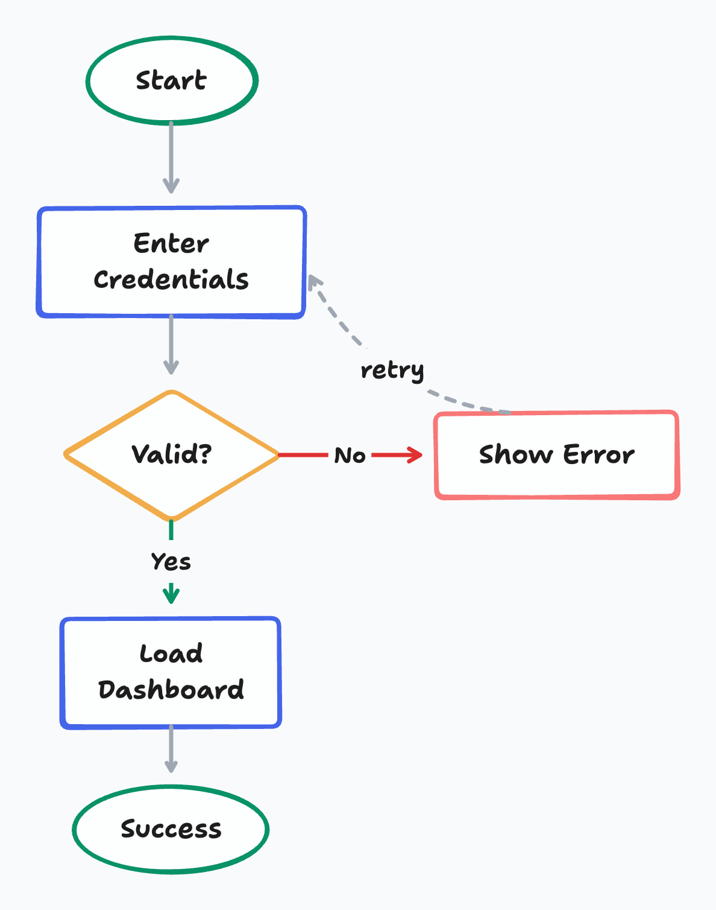
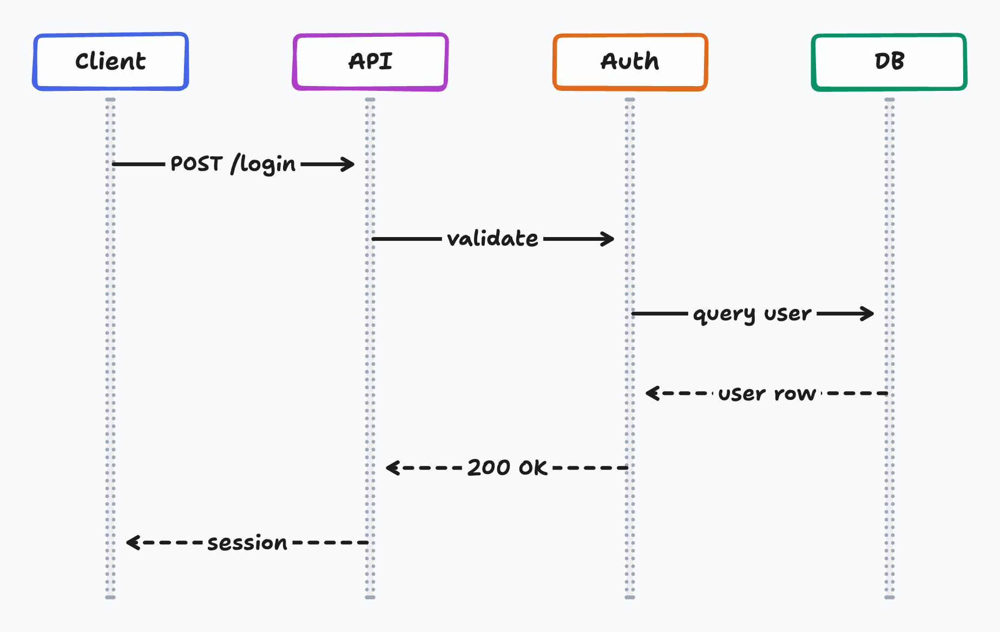
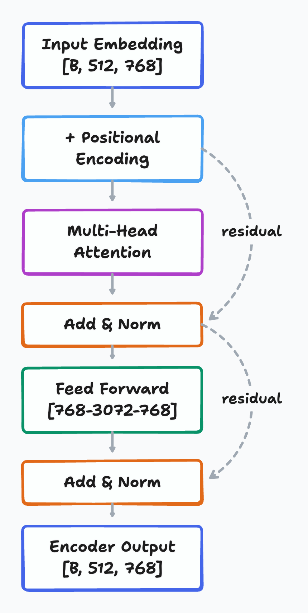
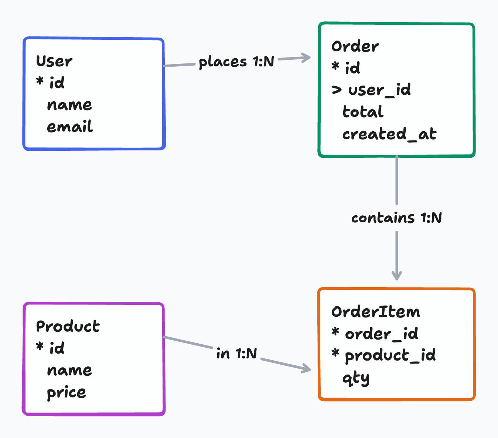
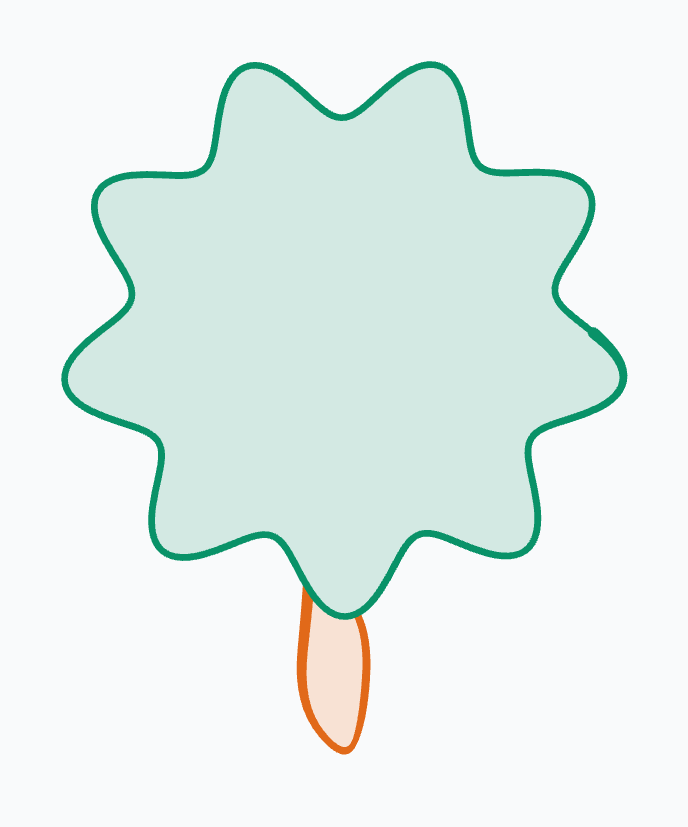
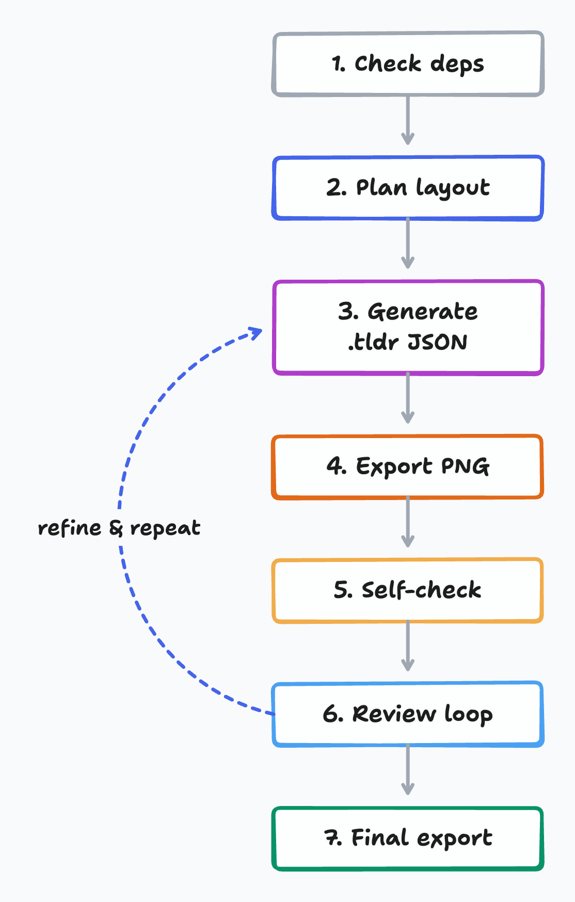

# tldraw-skill —— 从文字到白板风格图表

[](LICENSE)
[](https://github.com/Agents365-ai/tldraw-skill/stargazers)
[](https://github.com/Agents365-ai/tldraw-skill/network/members)
[](https://github.com/Agents365-ai/tldraw-skill/releases/latest)
[](https://github.com/Agents365-ai/tldraw-skill/commits/main)

[](https://skillsmp.com/skills/agents365-ai-tldraw-skill-skills-tldraw-skill-skill-md)
[](https://clawhub.ai/agents365-ai/tldraw-pro-skill)
[](https://github.com/Agents365-ai/365-skills)
[](https://agentskills.io)
[](https://discord.gg/79JF5Atuk)

[English](README.md) · **中文** · [📖 在线文档](https://agents365-ai.github.io/tldraw-skill/zh.html)

一个把自然语言变成手绘白板风格 `.tldr` 图表,并通过 [`@kitschpatrol/tldraw-cli`](https://github.com/kitschpatrol/tldraw-cli) 自动导出 PNG / SVG 的技能。支持 **Claude Code、Cursor、Copilot、OpenClaw、Codex、Hermes** 等任何兼容 [Agent Skills](https://agentskills.io) 规范的 agent。

<p align="center">
  
</p>

## ✨ 核心亮点

- **6 种图表类型预设** —— 架构图、流程图、时序图、ML / 深度学习、ER 图、UML 类图
- **基于视觉的自检 + 自动修复** —— 读取自己导出的 PNG,自动修复重叠、文字截断、缺失箭头、画布外形状、连线堆叠(最多 2 轮;需要支持视觉的模型)
- **迭代评审循环** —— 精准 JSON 编辑,最多 5 轮,之后建议在 tldraw.com 中手动微调
- **复杂度自适应布局** —— 间距(200 / 280 / 350px)随节点数自动放大;路由走廊与枢纽节点居中策略内置
- **13 色语义调色板** —— `blue` 服务、`green` 数据库、`violet` 认证、`orange` 队列、`yellow` 判断等,跨多次运行保持一致
- **零浏览器自动化** —— `tldraw-cli` 在有 Node 的地方都能跑;macOS / Linux / Windows 安装一致(无需 Chromium、无需 Playwright)

## 🖼️ 示例

> [!TIP]
> **页首那张图就是用下面这条提示词生成的:**

```
画一个微服务电商架构图,包含 Mobile/Web/Admin 客户端,API Gateway,
User/Order/Product/Payment 微服务,Kafka 事件总线,Notification 服务,
以及 User DB / Order DB / Product DB / Redis Cache / Stripe API
```

Skill 会在 10px 网格上规划形状位置,把箭头端点均匀分布在节点边缘,并在导出 PNG 后再次自检以提前发现重叠。

### 更多图表风格

下面每张都由一句自然语言提示词生成,并经过同一套自检流程导出:

<table>
  <tr>
    <td align="center" width="50%"></td>
    <td align="center" width="50%"></td>
  </tr>
  <tr>
    <td align="center"><b>流程图</b> —— <code>diamond</code> 判定节点、自动 Yes/No 标签、虚线重试回环</td>
    <td align="center"><b>时序图</b> —— 点线生命线、实线调用 vs. 虚线返回</td>
  </tr>
  <tr>
    <td align="center"></td>
    <td align="center"></td>
  </tr>
  <tr>
    <td align="center"><b>ML / Transformer</b> —— 张量形状标注、残差跳连</td>
    <td align="center"><b>ERD</b> —— PK <code>*</code> / FK <code>&gt;</code> 标记、关系基数标签</td>
  </tr>
</table>

<details>
<summary>这四张用到的提示词</summary>

- **流程图:** `画一个登录流程图:Start → 输入凭据 → 判定"是否有效?";是 → 加载仪表盘 → 成功;否 → 显示错误,然后回到输入凭据。`
- **时序图:** `画一个登录 API 的时序图:Client → API → Auth → DB,包含 POST /login、validate、query user,以及虚线返回消息(user row、200 OK、session)。`
- **ML / Transformer:** `画一个 Transformer 编码器块:输入嵌入 [B,512,768]、位置编码、多头注意力、Add & Norm、前馈 [768→3072→768]、Add & Norm、编码器输出 —— 带残差跳连。`
- **ERD:** `画一个电商 ERD,包含 User、Order、Product、OrderItem 实体;PK 用 * 标记、FK 用 > 标记;展示 1:N 关系 places / contains / in。`

</details>

### 它是白板 —— 也能随手画

tldraw 不只有方框和箭头。因为它本质是带自由笔迹(`draw` shape)的**手绘白板**,这个 skill 也能具象作画 —— 用 geo 图元(ellipse / triangle / heart)加自由笔迹,或者用参数方程生成纯自由笔迹曲线:

<table>
  <tr>
    <td align="center"></td>
    <td align="center"></td>
    <td align="center"></td>
  </tr>
  <tr>
    <td align="center"></td>
    <td align="center"></td>
    <td align="center"></td>
  </tr>
</table>

<sub><b>猫 / 狗</b> —— geo 图元 + 自由笔迹胡须和尾巴。<b>螺旋 / 花 / 蝴蝶 / 树</b> —— 用参数方程生成的纯自由笔迹 <code>draw</code> 曲线(蝴蝶是单笔 1400 个点)。这不是 skill 的<i>本职</i> —— 它是图表工具 —— 但能有趣地展示自由笔迹 <code>draw</code> shape 和手绘风格。源文件见 <a href="assets/">assets/</a>(<code>example-cat/dog/spiral/flower/butterfly/tree.tldr</code>)。</sub>

完整功能拆解见 [docs/features_CN.md](docs/features_CN.md)。已知限制(严格 UML 标记、PDF 导出、视觉模型依赖)见 [docs/limitations_CN.md](docs/limitations_CN.md)。

## 🚀 安装

### 1. 安装 `@kitschpatrol/tldraw-cli`

| 平台 | 命令 |
|------|------|
| **macOS / Linux / Windows** | `npm install -g @kitschpatrol/tldraw-cli` |

用 `tldraw --version` 验证。需要 Node.js(npm)。无浏览器自动化、无 Playwright —— 哪里有 Node,`tldraw-cli` 就在哪里跑。

### 2. 安装技能

```bash
# 任意 Agent(Claude Code、Cursor、Copilot 等)
npx skills add Agents365-ai/365-skills -g
```

```text
# Claude Code 插件市场
> /plugin marketplace add Agents365-ai/365-skills
> /plugin install tldraw
```

```bash
# 手动安装
git clone https://github.com/Agents365-ai/tldraw-skill.git \
  ~/.claude/skills/tldraw-skill
```

同时索引于 [SkillsMP](https://skillsmp.com/skills/agents365-ai-tldraw-skill-skills-tldraw-skill-skill-md) 与 [ClawHub](https://clawhub.ai/agents365-ai/tldraw-pro-skill)。

**更新:** `/plugin update tldraw`(Claude Code)、`skills update tldraw-skill`(SkillsMP)、`clawhub update tldraw-pro-skill`(OpenClaw),或 `git pull`(手动安装)。

## ⚡ 快速开始

装好之后直接描述你想要的图表,比如一个 ML 模型草图:

```
在白板上画一个 Transformer 编码器-解码器:6 层编码器(自注意力),
6 层解码器(交叉注意力),输入嵌入(batch × 512 × 768),位置编码,
最后一层输出投影。层之间标注张量形状,按层类型配色。
```

Skill 会自动规划布局、生成 `.tldr` JSON、导出 PNG/SVG、自检结果,并支持后续迭代。

## 🧩 支持的图表类型

| 类别 | 示例 | 特色 |
|------|------|------|
| 架构图 | 微服务、云、网络拓扑、部署 | 事件总线 hub 居中策略;分层泳道;`cloud`/`hexagon`/`triangle` 形状词汇 |
| 流程图 | 业务流程、工作流、决策树 | `ellipse` 起止节点、`diamond` 判断;自动给 Yes/No 分支加标签 |
| 时序图 | API 调用流、请求/响应、异步消息 | 生命线近似(细灰矩形);异步 / 返回用虚线箭头 |
| ML / 深度学习 | Transformer、CNN、LSTM、GRU | 节点标签内嵌张量形状;按层类型配色;skip 连接弯曲 |
| ER 图 | 实体关系、数据库 schema | 多行实体标签(PK `*` / FK `>`);箭头标签标注基数 |
| UML 类图 | 高层类图 | 多行类标签(属性 + 方法);继承 / 关联箭头(严格 UML 标记见[限制](docs/limitations_CN.md)) |

## 🔄 工作流程

<p align="center">
  
</p>

<p align="center"><sub><i>这张流程图就是用本 skill 自己画的 —— 见 <a href="assets/workflow.tldr">assets/workflow.tldr</a>。</i></sub></p>

1. **检查依赖** —— 验证 `tldraw --version`;缺失则提示 `npm install -g @kitschpatrol/tldraw-cli`。
2. **规划布局** —— 选择 geo 形状,在 10px 网格上分配节点位置,按节点数缩放间距。
3. **生成 `.tldr` JSON** —— 写入 shape + arrow 记录,带 binding 锚点和均匀分布的 `normalizedAnchor`。
4. **导出草稿 PNG** —— `tldraw export diagram.tldr -f png --scale 2 -o ./`。
5. **自检** —— 支持视觉的模型读取 PNG,自动修复重叠 / 文字截断 / 箭头穿越(最多 2 轮)。无视觉能力时跳过。
6. **评审循环** —— 展示给用户,应用定向编辑(改色、改标签、加/删节点、移动形状),重新导出 —— 最多 5 轮,之后建议在 tldraw.com 中手动微调。
7. **最终导出** —— 把通过的版本导出到所有请求格式,并报告文件路径。

## 🆚 对比

### 对比原生智能体(无 skill)

| 功能 | 原生智能体 | tldraw-skill |
|------|-----------|--------------|
| 导出后自检 | ❌ | ✅ 基于视觉,2 轮自动修复 |
| 迭代评审循环 | ❌ 需手动重新提问 | ✅ 定向 JSON 编辑,5 轮安全阀 |
| 图表类型预设 | ❌ | ✅ 6 种(架构、流程、时序、ML、ER、UML) |
| 复杂度自适应间距 | ❌ | ✅ 按节点数分 200 / 280 / 350px 三档 |
| 配色方案 | 随机 / 不一致 | ✅ 13 色语义系统 |
| 节点上箭头分布 | 随机锚点 → 堆叠 | ✅ 沿形状周长均匀分布 |
| 网格对齐 | ❌ | ✅ 10px 对齐,匹配 tldraw 默认网格 |
| 多行张量 / 字段标签 | 临时凑 | ✅ 内嵌 `\n` 格式化内置 |

## 🔗 相关 Skill

[Agents365-ai 图表 skill 家族](https://github.com/Agents365-ai) 一员 —— 按场景挑工具:

| Skill | 风格 | 适用场景 |
|---|---|---|
| [drawio-skill](https://github.com/Agents365-ai/drawio-skill) | 商务正式 | 汇报材料、严格 UML、ML 论文、网络拓扑 |
| [excalidraw-skill](https://github.com/Agents365-ai/excalidraw-skill) | 手绘 / 草图 | 白板原型、非正式图 |
| [mermaid-skill](https://github.com/Agents365-ai/mermaid-skill) | 文本驱动、自动布局 | 可嵌入 README、易于版本管理 |
| [plantuml-skill](https://github.com/Agents365-ai/plantuml-skill) | UML 专精 | CI 流水线里的类图 / 序列图 |

## 💬 社区

- **Discord:** https://discord.gg/79JF5Atuk
- **微信:** 扫描下方二维码

<p align="center">
  
</p>

## ❤️ 支持作者

如果这个 skill 对你有帮助,欢迎支持作者:

<table>
  <tr>
    <td align="center">
      
      <br>
      <b>微信支付</b>
    </td>
    <td align="center">
      
      <br>
      <b>支付宝</b>
    </td>
    <td align="center">
      
      <br>
      <b>Buy Me a Coffee</b>
    </td>
    <td align="center">
      
      <br>
      <b>打赏</b>
    </td>
  </tr>
</table>

## 👤 作者

**Agents365-ai**

- GitHub: https://github.com/Agents365-ai
- Bilibili: https://space.bilibili.com/441831884

## 📄 许可证

[MIT](LICENSE)
